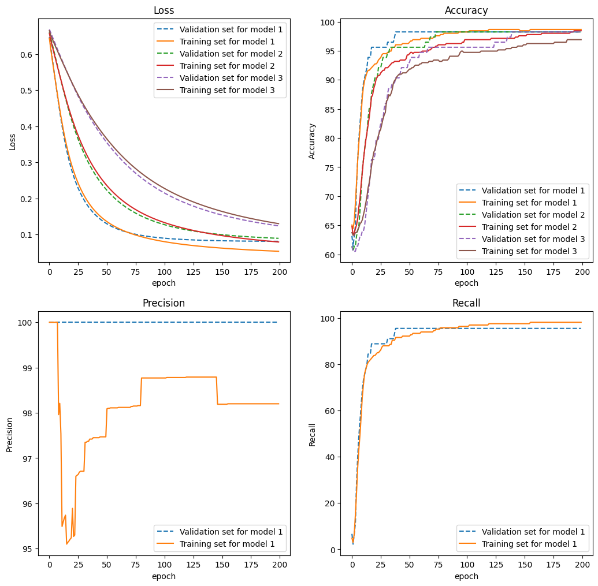

# Multilayer Perceptron project of 42
42 School loves to have its students code basic things from scratch to ensure a thorough understanding before utilizing pre-existing solutions.

This project aims to recreate a neural network in Python using only NumPy. I utilized a class to define a DenseLayer and a class for the neural network itself. Both of my classes are fully modular and accept various initializers for weights, loss functions, activation functions, number of neurons in a hidden layer, number of hidden layers, etc.

My MLP is then utilized to develop a program that learns from medical data to classify tumors as benign or malignant.

## Concepts Covered in the Project
- Forward Propagation
- Backpropagation
- Gradient Descent
- Activation Functions
- Weight Initializer Functions
- Early Stopping
- Binary Cross-Entropy Loss

The main program, MLP.py, works in three steps:

- **Step 1: Split Dataset**
    - Split the dataset into two parts (training and validation).
    - Create data_train.csv and data_val.csv files.
- **Step 2: Train the Neural Network**
    - If a model already exists in the directory, load it and start training.
    - Otherwise, initialize a new neural network model and train it.
- **Step 3: Predict**
    - Load the model and make predictions about tumors.

## Possible Arguments of the MLP.py Program
- --steps STEPS [STEPS ...], -s STEPS [STEPS ...]: Steps to run
- --dataset DATASET, -ds DATASET: Path to the full dataset (training and validation)
- --valPart VALPART, -v VALPART: Portion of the data to use for validation
- --layer LAYER [LAYER ...], -la LAYER [LAYER ...]: Name of the learning saving file
- --loss LOSS, -lo LOSS: Loss function to use
- --learningRate LEARNINGRATE, -lr LEARNINGRATE: Learning Rate to use
- --batchSize BATCHSIZE, -bs BATCHSIZE: Size of the batches
- --epochs EPOCHS, -e EPOCHS: Number of epochs
- --dataToPredict DATATOPREDICT, -dtp DATATOPREDICT: Path to the dataset to predict
- --resetTraining, -r: Reset the learning
- --earlyStop, -es: Early stop on
- --precisionRecall, -pr: Show Precision and Recall


## How to Start the Program
```python src/MLP.py --steps 1 2 3 --dataset data/data.csv --layer 8 8 2 softmax --epochs 200 --resetTraining --valPart 0.2```

## Bonus Programs
To better select parameters for my neural network, I implemented a class MLPComparator.py to plot different training histories and indicators (evolution of the loss function, accuracy, recall, and precision). See ResultVisu.ipynb for more details. 


